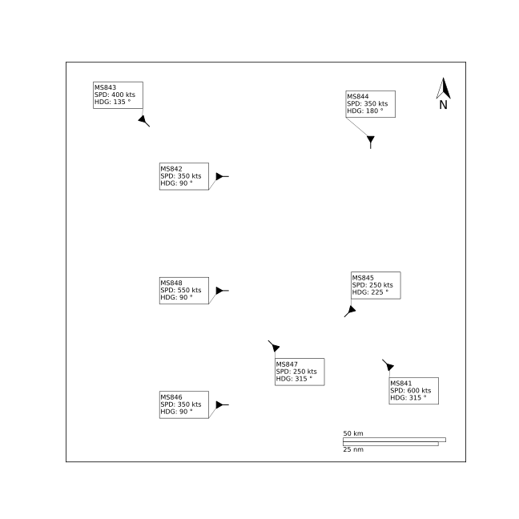
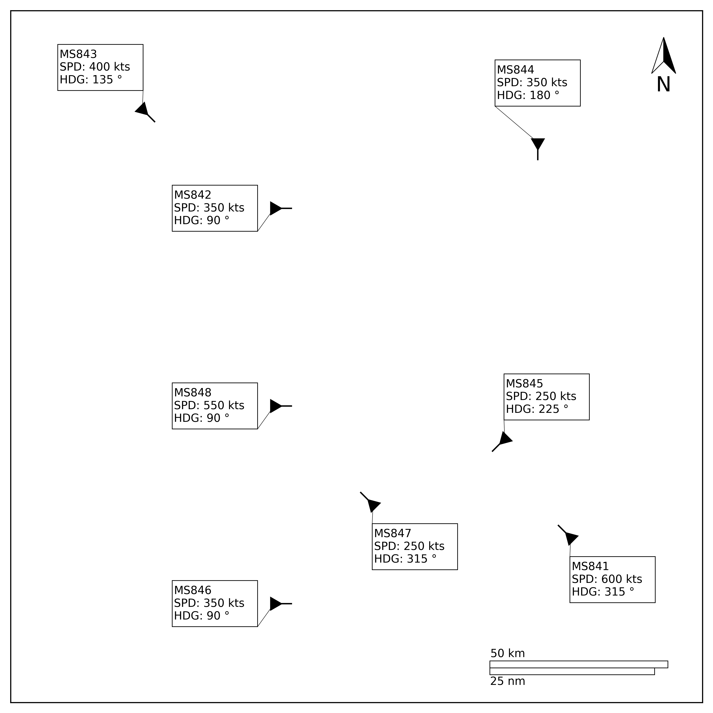

AirTrafficDevTool
=================

**AirTrafficDevTool**, short for **Air Traffic Development Tool**, is a python package to develop air traffic scenarios. The main application of this package will be in future-ATM related research. This package will help the user in visualizing air traffic scenarios in different perspectives. This in turn helps in designing air traffic scenarios for experiments in ATM research.

The package initially started just as a script to generate high resolution images in vector graphics format. This script later evolved to a package, what is now named as **AirTrafficDevTool**. At this point, you can not only use it for creating high quality image files, but also for designing air traffic scenarios, and exporting it in a customized text formats.

## Examples
* Overall perspective of the scenario or as seen from an ATCO's perspective

     
* SSD visualization
    1. A circular SSD for full situational awareness

         

    2. A semi-circular SSD for Navigation Display perspective
    3. Same color SSD or multi-colored SSD, based on Time to Loss of Separation (*TLOS*)
    
## Development of AirTrafficDevTool

This is a tool for research developed by a student. If you find any mistakes or want to request a feature, you are welcome to leave your comments and feedback. You are also encouraged to contribute to the development of this package.